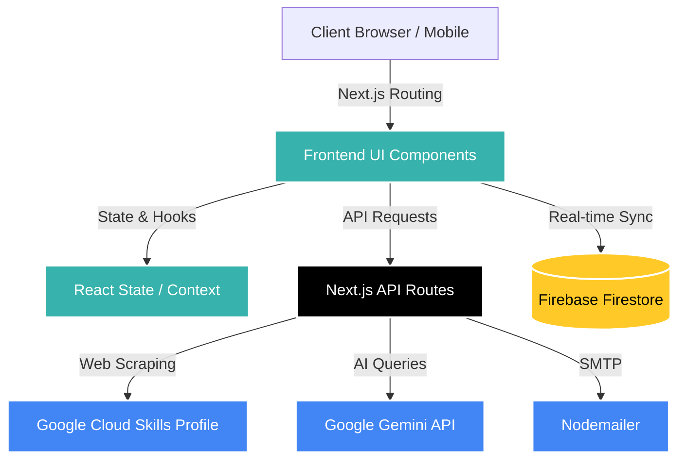

<div align="center">
  

  <br />
  <br />

  # 🎮 Google Arcade Nexus
  **The Ultimate Companion for Google Cloud Skills Boost Arcade**

  [](#)
  [](#)
  [](#)
  [](#)
  [](#)
  [](#)
  [](#)

  [**Live Demo**](https://arcade-calculator.vercel.app/) • [**Report Bug**](https://github.com/M-pixie/my-arcade-project/issues) • [**Request Feature**](https://github.com/M-pixie/my-arcade-project/issues)
</div>

---

## 📖 About The Project

The **Arcade Nexus Platform** is a high-performance, comprehensive web platform designed specifically for participants of the Google Cloud Skills Boost Arcade program. 

**The Problem:** Participants previously lacked a centralized, automated way to track their progress, calculate their earned points, and stay connected with the community and facilitator updates.

**The Solution:** This platform brings a nostalgic, arcade-inspired UI to everyday progression tracking, offering a real-time leaderboard, smart dashboards, and AI-powered community tools.

**Main Objective:** To enhance the developer experience for Google Cloud learners by gamifying their journey and providing reliable, real-time metrics.

---

## ✨ Key Features

- **🔢 Points Calculator:** Get reliable Arcade point calculations directly from your public profile URL (powered by automated parsing).
- **📊 Smart Dashboard:** View total points, recent activity, rank, and history in a beautifully designed, clean interface.
- **🏆 Live Leaderboard:** Compete with others and track your position in real-time, backed by Firebase Firestore.
- **🤝 Facilitator Hub:** Access expert guidance, FAQs, and connect directly with community leads.
- **🤖 AI Integration:** Leverage Google Generative AI for smart chat and automated interactions.
- **✉️ Automated Notifications:** Email integrations via Nodemailer for seamless communication.
- **📸 Image Processing:** Built-in tools for avatar cropping (`react-image-crop`) and sharing (`html2canvas`).

---

## 🛠️ Tech Stack

<details open>
<summary><b>Frontend</b></summary>
<br>

- **Framework:** [Next.js 16](https://nextjs.org/) (App Router)
- **Library:** [React 19](https://react.dev/)
- **Styling:** [Tailwind CSS v4](https://tailwindcss.com/)
- **Icons:** [Lucide React](https://lucide.dev/)
- **Markdown:** `react-markdown`, `remark-gfm`
</details>

<details open>
<summary><b>Backend & Database</b></summary>
<br>

- **Backend:** Next.js Serverless API Routes
- **Database:** [Firebase Firestore](https://firebase.google.com/docs/firestore) (Real-time NoSQL)
- **Web Scraping:** [Cheerio](https://cheerio.js.org/) (Profile parsing)
</details>

<details open>
<summary><b>AI & External APIs</b></summary>
<br>

- **AI Model:** [Google Generative AI](https://ai.google.com/) (Gemini)
- **Emails:** [Nodemailer](https://nodemailer.com/)
</details>

<details open>
<summary><b>Deployment & Tools</b></summary>
<br>

- **Hosting:** [Vercel](https://vercel.com/)
- **Language:** TypeScript
- **Linting:** ESLint
- **Requests:** Axios
</details>

---

## 🏗️ Architecture



---

## 📂 Folder Structure

```text
my-arcade-project/
├── app/
│   ├── about/              # About page routes
│   ├── admin-nexus-2026/   # Admin dashboard & controls
│   ├── api/                # Next.js serverless functions (calculate, chat)
│   ├── calculator/         # Points calculator feature
│   ├── chat/               # AI chat interface
│   ├── components/         # Reusable UI components (Navbar, FAQ, etc.)
│   ├── dashboard/          # User smart dashboard
│   ├── facilitator/        # Facilitator program pages
│   ├── leaderboard/        # Real-time ranking system
│   ├── post/               # Community posting features
│   ├── resources/          # Static and external resources
│   ├── globals.css         # Global Tailwind styles
│   ├── layout.tsx          # Root Next.js layout
│   └── page.tsx            # Main landing page
├── lib/                    # Core utilities and configurations
│   ├── firebase.ts         # Firebase initialization
│   ├── leaderboard.ts      # Leaderboard logic and state
│   └── validateProfile.ts  # URL validation utilities
├── public/                 # Static assets (images, icons)
├── tailwind.config.js      # Tailwind CSS configuration
├── next.config.js          # Next.js configuration
└── package.json            # Project dependencies and scripts
```

---

## 🚀 Installation & Setup

Follow these steps to run the project locally on your machine.

### Prerequisites
- Node.js (v20+ recommended)
- npm or yarn or pnpm
- Firebase Account
- Google Gemini API Key

### Step-by-Step Guide

1. **Clone the repository**
   ```bash
   git clone https://github.com/M-pixie/my-arcade-project.git
   cd my-arcade-project
   ```

2. **Install dependencies**
   ```bash
   npm install
   ```

3. **Set up Environment Variables**
   Create a `.env.local` file in the root directory and add the necessary keys (see Environment Variables section).

4. **Start the development server**
   ```bash
   npm run dev
   ```

5. **Open the application**
   Navigate to `http://localhost:3000` in your web browser.

---

## 🔐 Environment Variables

To run this project, you will need to add the following environment variables to your `.env.local` file:

> [!IMPORTANT]
> Never commit your `.env.local` file to version control. Always keep your API keys secure.

| Variable | Description |
| :--- | :--- |
| `NEXT_PUBLIC_FIREBASE_API_KEY` | Your Firebase Project API Key |
| `NEXT_PUBLIC_FIREBASE_AUTH_DOMAIN` | Firebase Auth Domain |
| `NEXT_PUBLIC_FIREBASE_PROJECT_ID` | Firebase Project ID |
| `NEXT_PUBLIC_FIREBASE_STORAGE_BUCKET`| Firebase Storage Bucket |
| `NEXT_PUBLIC_FIREBASE_MESSAGING_SENDER_ID`| Firebase Messaging Sender ID |
| `NEXT_PUBLIC_FIREBASE_APP_ID` | Firebase App ID |
| `GEMINI_API_KEY` | Google Generative AI Key |
| `EMAIL_USER` | SMTP Email Address (Nodemailer) |
| `EMAIL_PASS` | SMTP Email Password / App Password |

---

## 💻 Running the Project

**Development Mode:**
```bash
npm run dev
```

**Production Build:**
```bash
npm run build
npm run start
```

**Linting Code:**
```bash
npm run lint
```

---

## 📸 Screenshots


| Dashboard View | Leaderboard View |
| :---: | :---: |
|  |  |
| *Smart User Dashboard* | *Real-time Global Leaderboard* |

| Points Calculator | AI Chat Interface |
| :---: | :---: |
|  |  |
| *Automated Cloud Skills Tracking* | *Gemini-powered Assistant* |

---

## 📡 API Overview

The application utilizes Next.js Serverless API routes located in `app/api/`.

| Endpoint | Method | Description |
| :--- | :--- | :--- |
| `/api/calculate` | `POST` | Accepts a Google Cloud profile URL, parses the public page using Cheerio, and calculates earned Arcade points. |
| `/api/chat` | `POST` | Interfaces with Google Gemini API to provide contextual responses to user queries. |

---

## 🧠 AI Workflow

1. **User Prompt:** The user submits a query through the Chat interface (`/chat`).
2. **API Route:** The request is sent securely to the Next.js API route (`/api/chat`).
3. **Gemini Integration:** The `@google/generative-ai` SDK processes the prompt using the configured model (e.g., Gemini 1.5 Pro).
4. **Response Delivery:** The response is streamed or returned as JSON and rendered using `react-markdown` on the client UI.

---

## 🔄 Project Workflow

1. **Onboarding:** User lands on the homepage, learns about the Google Cloud Arcade program, and navigates to the calculator or dashboard.
2. **Data Ingestion:** User inputs their Google Cloud Skills Boost public profile URL.
3. **Calculation:** The backend parses the URL, identifies completed badges (standard, advanced, skill badges), and computes the total points based on complex Arcade rules.
4. **Community Sync:** The user's points are synced to Firebase Firestore and displayed on the Live Leaderboard.
5. **Engagement:** Users can ask questions to the AI assistant, contact facilitators, or share their generated stats card.

---

## ⚡ Performance

- **App Router:** Fully embraces React Server Components (RSC) to ship less JavaScript to the client.
- **Edge Caching:** API responses and static assets are cached via Vercel's Edge Network.
- **Optimized Fonts & Images:** Utilizes `next/font` and `next/image` for automatic optimization and zero layout shift.

---

## 🛡️ Security

- **Environment Variables:** Sensitive keys (Firebase Admin, Gemini API) are kept strictly on the server-side.
- **Validation:** Input validation on API endpoints to prevent malformed URL injection.
- **Firestore Rules:** Database reads/writes are protected by stringent Firebase Security Rules, ensuring users can only modify their own data.

---

## 🚀 Future Improvements

- [ ] **OAuth Integration:** Direct Google sign-in instead of relying solely on public profile URLs.
- [ ] **Progress History Charts:** Visual graphs to track point progression over time.
- [ ] **PWA Support:** Convert the app into a Progressive Web App for offline capabilities and mobile home screen installation.
- [ ] **Multi-language Support:** i18n implementation for global Arcade participants.

---

## 🤝 Contributing

Contributions are what make the open source community such an amazing place to learn, inspire, and create. Any contributions you make are **greatly appreciated**.

1. Fork the Project
2. Create your Feature Branch (`git checkout -b feature/AmazingFeature`)
3. Commit your Changes (`git commit -m 'Add some AmazingFeature'`)
4. Push to the Branch (`git push origin feature/AmazingFeature`)
5. Open a Pull Request

---

## 📄 License

Distributed under the MIT License. See `LICENSE` for more information.

---

## ✍️ Author

**Manish Kumar & Anjali Patel**

- GitHub: [@M-pixie](https://github.com/M-pixie) | [@Anjal08](https://github.com/Anjal08)

---

## 💬 Support

If you found this project helpful, please give it a ⭐️ on GitHub!

For any inquiries, reach out via the [Issues](https://github.com/M-pixie/my-arcade-project/issues) tab.

---

## 🙏 Acknowledgements

- [Next.js Documentation](https://nextjs.org/docs)
- [Google Cloud Skills Boost](https://www.cloudskillsboost.google/)
- [Tailwind CSS](https://tailwindcss.com/)
- [Vercel](https://vercel.com/)
- [Lucide Icons](https://lucide.dev/)

<div align="center">
  <sub>Built with passion for the web.</sub>
</div>